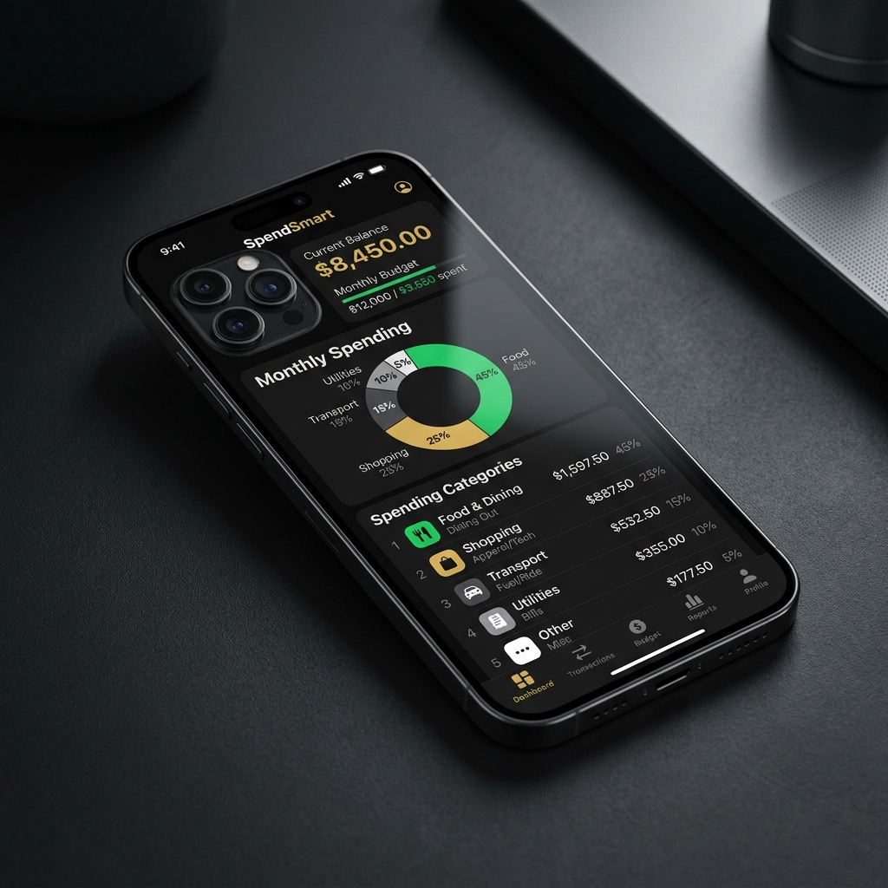
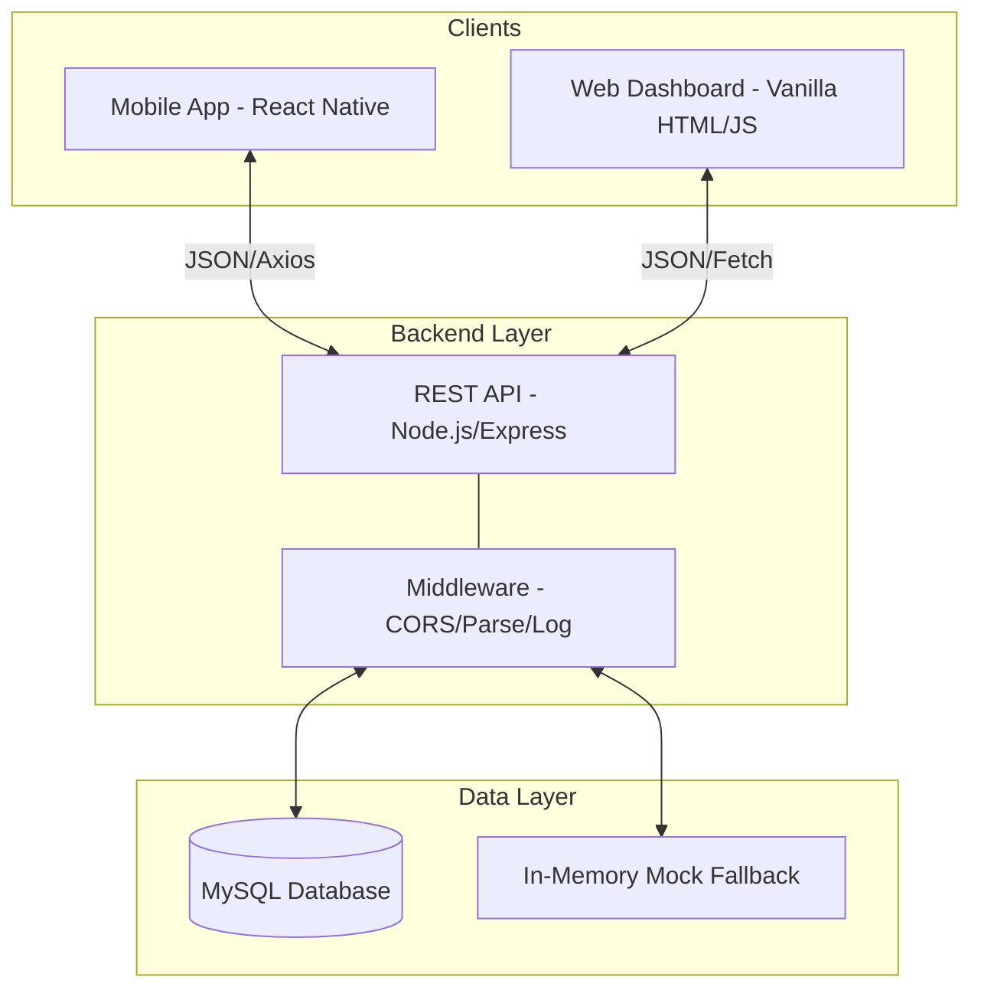

# Expense Tracker App — by Hxni


> **A premium, high-performance financial management ecosystem.** 
> Built with a cross-platform architecture, featuring a robust Node.js backend, React Native mobile client, and a real-time web dashboard.

---

## 📸 Interface Preview

<p align="center">
  
</p>

---

## 🏗️ System Architecture

The project follows a decoupled **Client-Server** architecture, ensuring scalability and separation of concerns.



### Technical Highlights:
- **MVC Pattern:** The backend implements a clean Model-View-Controller structure for manageable business logic.
- **Dual Frontends:** Targeted experiences for both mobile (on-the-go tracking) and web (detailed analysis).
- **Responsive Data Flow:** Real-time updates across interfaces using standardized RESTful communication.

---

## 🚀 Key Features

- **💎 Elite UI/UX:** Designed with a "Glassmorphism" aesthetic, featuring gold accents (`#FFD600`) and a sleek dark mode.
- **📊 Advanced Analytics:** Automatic category-based spending breakdown and cash flow visualization.
- **⚡ Performance First:** Optimized for low-latency data fetching and smooth micro-animations.
- **🛡️ Data Integrity:** Secure backend validation and standardized error handling.
- **🔄 Hybrid Storage:** Persistent MySQL storage with an intelligent mock fallback for testing/demo environments.

---

## 🛠️ Tech Stack

| Layer | Technology | Key Library |
| :--- | :--- | :--- |
| **Mobile** | React Native | Expo SDK 54, Axios |
| **Web** | HTML5 / JavaScript | Chart.js, Lucide Icons |
| **Backend** | Node.js | Express, Morgan, Dotenv |
| **Database** | MySQL | mysql2/promise (Async/Await) |
| **Design** | CSS3 / Stylesheet | Glassmorphism, CSS Variables |

---

## 📡 API Reference

The backend provides a comprehensive RESTful API for all financial operations.

### Transaction Endpoints

| Method | Endpoint | Description |
| :--- | :--- | :--- |
| `GET` | `/api/transactions` | Retrieve all transactions (Latest first) |
| `POST` | `/api/transactions` | Create a new income/expense entry |
| `GET` | `/api/transactions/:id` | Fetch detailed data for a specific entry |
| `PUT` | `/api/transactions/:id` | Update an existing transaction |
| `DELETE` | `/api/transactions/:id` | Remove a transaction from the ledger |

### Analytics Endpoints

| Method | Endpoint | Description |
| :--- | :--- | :--- |
| `GET` | `/api/transactions/summary` | Get totals (Income, Expense, Balance) |
| `GET` | `/api/transactions/categories` | Get spending breakdown by category |
| `GET` | `/health` | Verify API status and version |

---

## 📂 Project Structure

```text
FullStackApp/
├── assets/                 # Brand assets & mockups
├── backend/                # Server-side logic (Node/Express)
│   ├── controllers/        # Business logic & DB queries
│   ├── db/                 # SQL schemas & MySQL connection
│   ├── routes/             # API Endpoints
│   └── server.js           # Entry point
├── frontend/               # Mobile Client (Expo)
│   ├── components/         # Reusable atomic UI
│   ├── screens/            # Application views
│   └── services/           # Network abstraction
└── dashboard.html          # Web-based analytics dashboard
```

---

## ⚙️ Quick Start

### 1. Backend Initialization
```bash
cd backend
npm install
cp .env.example .env  # Configure your DB credentials
npm start             # Default: http://localhost:5000
```

### 2. Frontend Execution
```bash
cd frontend
npm install
npx expo start        # Scan QR with Expo Go
```

---

<p align="center">
  Made with 🖤 by <strong>Hxni</strong><br/>
  <em>Transforming personal finance management.</em>
</p>
